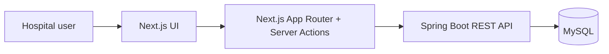
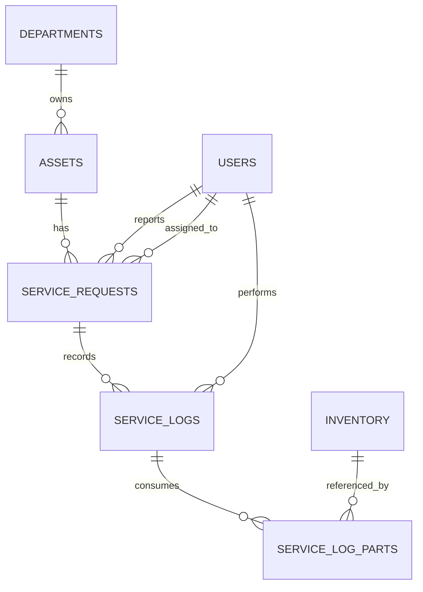

# Architecture

This document describes the current architecture of the Medical Asset &
Maintenance Management System. It is intended to be the technical reference for
developers who need to understand the runtime topology, code organization,
domain model, security boundaries, and main business workflows.

## 1. System Context

The system is a web application for managing hospital medical equipment,
maintenance requests, spare-part inventory, repair costs, and basic operational
analytics.



The application is split into two independently runnable projects:

- `frontend/`: Next.js 14, React 18, TypeScript, Tailwind CSS, shadcn-style UI
  components, Server Actions.
- `backend/`: Spring Boot 3.2.5, Java 21, Spring MVC, Spring Security, JWT,
  Spring Data JPA, MySQL, MapStruct, Lombok.

## 2. Runtime Architecture

### Frontend Runtime

The browser renders pages from the Next.js App Router. Authentication state is
stored in cookies after login:

- `token`: HTTP-only JWT used by Server Actions when calling the backend.
- `user`: non-HTTP-only user display data used by the layout/header.

Most backend calls are made from files under `frontend/app/actions/` using
Next.js Server Actions. The `frontend/lib/axios.ts` helper also exists for
client-side API calls, but the current primary integration path is:

```text
Page or component -> Server Action -> Spring Boot API -> MySQL
```

Middleware in `frontend/middleware.ts` protects application routes by redirecting
unauthenticated users to `/login`.

### Backend Runtime

The backend exposes REST APIs under `/api/**`. It uses stateless JWT security:

```text
HTTP request
  -> JwtAuthenticationFilter
  -> Spring Security authorization rules
  -> Controller
  -> Service
  -> Repository
  -> MySQL
```

OpenAPI documentation is exposed through:

- `/api-docs`
- `/swagger-ui.html`

## 3. Backend Package Structure

```text
backend/src/main/java/com/medical/system
+-- config/        Application, security, OpenAPI, and seed-data configuration
+-- controller/    REST controllers and HTTP request mapping
+-- dto/           Request/response DTOs and API wrapper types
+-- exception/     Application exceptions and global exception handling
+-- mapper/        Entity-to-DTO mapping, currently MapStruct-based
+-- model/
|   +-- entity/    JPA entities persisted to MySQL
|   +-- enums/     Domain enums: Role, AssetStatus, RequestStatus
+-- repository/    Spring Data JPA repositories
+-- security/      JWT generation, JWT filter, UserDetailsService
+-- service/       Transactional business use cases
+-- MedicalSystemApplication.java
```

### Layer Responsibilities

| Layer | Responsibility |
| --- | --- |
| Controller | HTTP mapping, validation entrypoint, response wrapping |
| Service | Business rules, transaction boundaries, workflow state changes |
| Repository | Database access through Spring Data JPA |
| Entity | Persistent domain state and relationships |
| DTO/Mapper | API-safe response shape and entity projection |
| Security | Authentication, JWT validation, role-based authorization |
| Exception | Consistent API errors through `ApiResponse` |

Controllers should stay thin. Workflow decisions such as status transitions,
stock deduction, repair assignment, and repair completion belong in services.

## 4. Frontend Structure

```text
frontend/
+-- app/
|   +-- actions/      Server Actions that call the backend API
|   +-- analytics/    Maintenance scoring and reporting UI
|   +-- assets/       Asset list and failure reporting UI
|   +-- inventory/    Spare-part inventory UI
|   +-- login/        Authentication page
|   +-- repairs/      Repair request workflow UI
|   +-- users/        User management UI
|   +-- layout.tsx    Auth-aware application shell
|   +-- page.tsx      Main dashboard
+-- components/       Shared app components and UI primitives
+-- lib/              Utilities and optional Axios client
+-- types/            Shared TypeScript API/domain types
+-- middleware.ts     Route guard based on auth cookies
```

The frontend should keep API calls centralized in `app/actions/`. Components
should prefer calling Server Actions instead of duplicating REST request logic.

## 5. API Design

All backend responses are wrapped in `ApiResponse<T>`:

```json
{
  "status": "SUCCESS",
  "message": "Human-readable result",
  "data": {},
  "errors": null,
  "timestamp": "2026-05-14T00:00:00"
}
```

Main endpoint groups:

| Area | Endpoints |
| --- | --- |
| Auth | `POST /api/auth/login` |
| Assets | `GET /api/assets`, `PATCH /api/assets/{id}/department` |
| Maintenance | `POST /api/assets/{id}/report-failure`, `GET /api/service-requests`, `PATCH /api/service-requests/{id}/assign`, `POST /api/service-requests/{id}/complete` |
| Inventory | `GET /api/inventory` |
| Departments | `GET /api/departments` |
| Users | `GET /api/users`, `GET /api/users/{id}` |
| Finance | `GET /api/finance/summary`, `GET /api/finance/assets`, `GET /api/finance/departments`, `PATCH /api/finance/assets/{id}`, `PATCH /api/finance/inventory/{id}` |
| Analytics | `GET /api/analytics/assets/scores`, `GET /api/analytics/departments/scores` |

## 6. Security Model

Authentication uses username/password login and JWT bearer tokens. The backend is
stateless and does not maintain server sessions.

### Roles

| Role | Main capabilities |
| --- | --- |
| `ADMIN` | Manage users view, finance reports, assign repairs, assign departments |
| `DOCTOR` | Report equipment failure |
| `ENGINEER` | View repair requests, inspect inventory, complete assigned repairs |

### Backend Authorization Rules

Authorization is configured in `SecurityConfig`:

- Public: `/api/auth/**`, Swagger/OpenAPI endpoints.
- Admin only: `/api/users/**`, `/api/finance/**`,
  `PATCH /api/assets/*/department`, `PATCH /api/service-requests/*/assign`.
- Doctor/Admin: `POST /api/assets/*/report-failure`.
- Engineer only: `POST /api/service-requests/*/complete`.
- Engineer/Admin: `/api/service-requests/**`, `/api/inventory/**`.
- Authenticated users: `/api/assets/**`, `/api/departments/**`,
  `/api/analytics/**`.

## 7. Domain Model



### Core Entities

| Entity | Purpose |
| --- | --- |
| `User` | Login account with role: `ADMIN`, `DOCTOR`, or `ENGINEER` |
| `Department` | Hospital department that owns or uses assets |
| `Asset` | Medical equipment with status and financial metadata |
| `Inventory` | Spare part stock with quantity and unit cost |
| `ServiceRequest` | Failure report and repair lifecycle state |
| `ServiceLog` | Repair completion details, labor cost, and metadata |
| `ServiceLogPart` | Join entity for parts consumed by a service log |

### State Enums

- `AssetStatus`: `AVAILABLE`, `BROKEN`, `UNDER_MAINTENANCE`.
- `RequestStatus`: `PENDING`, `ASSIGNED`, `COMPLETED`.

## 8. Main Business Workflows

### Report Failure

```text
Doctor/Admin selects asset
  -> POST /api/assets/{id}/report-failure
  -> validate asset is AVAILABLE
  -> asset.status = BROKEN
  -> create ServiceRequest(status = PENDING)
```

### Assign Repair

```text
Admin selects pending request and engineer
  -> PATCH /api/service-requests/{id}/assign
  -> validate selected user is ENGINEER
  -> request.status = ASSIGNED
  -> request.assignedEngineer = engineer
  -> asset.status = UNDER_MAINTENANCE
```

### Complete Repair

```text
Assigned engineer submits resolution and used parts
  -> POST /api/service-requests/{id}/complete
  -> validate request is ASSIGNED
  -> validate current engineer owns the assignment
  -> deduct used part quantities from Inventory
  -> create ServiceLog and ServiceLogPart rows
  -> request.status = COMPLETED
  -> asset.status = AVAILABLE
```

## 9. Data Persistence

The backend uses Spring Data JPA with MySQL. Schema generation is currently
configured through Hibernate:

```yaml
spring.jpa.hibernate.ddl-auto: update
```

Default users, departments, assets, and inventory records are created by
`DefaultDataBootstrap` only when missing. It does not wipe existing data on
startup.

Important persistence notes:

- Monetary fields use `BigDecimal` with explicit precision/scale.
- Entity relationships use lazy loading by default.
- Repair cost is derived from labor cost plus inventory unit cost usage.
- `ServiceLog.additionalLogData` stores JSON-like text for flexible metadata.

## 10. Configuration

Backend configuration is in `backend/src/main/resources/application.yml`.
Important environment variables:

| Variable | Default | Purpose |
| --- | --- | --- |
| `SPRING_DATASOURCE_URL` | `jdbc:mysql://localhost:3306/medical_system?createDatabaseIfNotExist=true` | MySQL JDBC URL |
| `SPRING_DATASOURCE_USERNAME` | `root` | Database username |
| `SPRING_DATASOURCE_PASSWORD` | local default in `application.yml` | Database password |
| `JWT_SECRET` | local development secret | JWT signing secret |
| `SERVER_PORT` | `8080` | Backend HTTP port |

Frontend API configuration:

| Variable | Default | Purpose |
| --- | --- | --- |
| `API_URL` | `http://localhost:8080/api` | Server Action backend URL |
| `NEXT_PUBLIC_API_URL` | `http://localhost:8080/api` | Client-side Axios backend URL |

## 11. Local Development

Backend:

```bash
cd backend
mvn spring-boot:run
```

Frontend:

```bash
cd frontend
npm install
npm run dev
```

Default local URLs:

- Frontend: `http://localhost:3000`
- Backend API: `http://localhost:8080/api`
- Swagger UI: `http://localhost:8080/swagger-ui.html`

Default seeded accounts:

| Role | Username | Password |
| --- | --- | --- |
| Admin | `admin` | `admin123` |
| Doctor | `doctor` | `doctor123` |
| Engineer | `engineer` | `engineer123` |

## 12. Deployment Notes

The backend should be deployed as a Spring Boot service connected to a managed
MySQL database.

The frontend uses Next.js Server Actions, so it should be deployed on a runtime
that supports the Next.js server, not as a purely static export.

Production hardening checklist:

- Use a strong `JWT_SECRET` from the deployment secret manager.
- Restrict CORS origins to the production frontend domain.
- Replace `ddl-auto: update` with migration tooling such as Flyway or Liquibase.
- Set secure production values for `API_URL` and `NEXT_PUBLIC_API_URL`.
- Use managed logs and metrics for API errors, auth failures, and repair events.

## 13. Architecture Guidelines

- Keep business rules in services, not controllers or React components.
- Keep backend response shapes stable and represented in `frontend/types`.
- Prefer DTOs for API responses where entities contain lazy relationships or
  sensitive fields.
- Add repository queries only when they express a real data-access need.
- Keep frontend API integration in Server Actions unless a feature explicitly
  requires client-side polling or optimistic client state.
- Treat financial and inventory updates as transactional operations.
